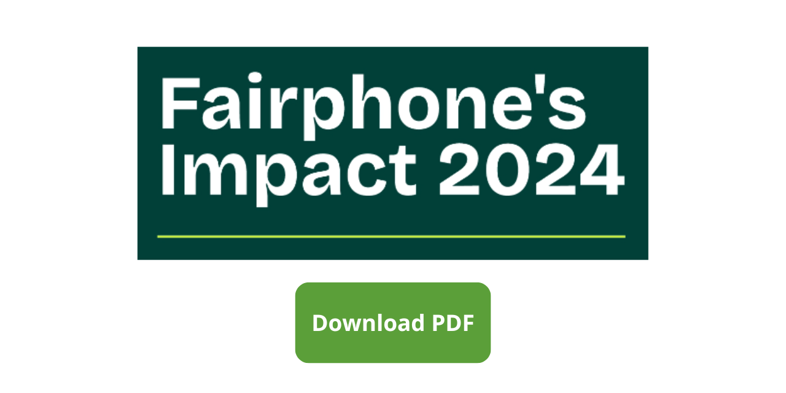

# Fairphone Sustainability Website (Bachelor Thesis)
A single-page corporate-style website developed as part of my Bachelor's Degree in **Information Technology for Digital Companies**.



The project reproduces a realistic company website dedicated to sustainability reporting, combining **frontend development** (UI and interaction) and **business analysis** (content organization and structure).

**Live demo**
https://enzo-94-prog.github.io/bachelor-thesis/

---

## Project Overview

This project simulates a real corporate website rather than a simple static page.

The website presents structured sustainability content and includes interactive behavior implemented with **Vanilla JavaScript**, such as navigation handling and dynamic language switching.

The goal was to translate a business case study (Fairphone’s sustainability strategy) into an actual working interface, focusing on:

* information architecture
* navigation usability
* UI interaction logic
* separation between structure, styling and behavior

---

## Preview

<table align="center">
  <tr>
    <td align="center">
      
    </td>
    <td align="center">
      
    </td>
    <td align="center">
      
    </td>
  </tr>
</table>

---

## Main Features

* Multi-page website structure
* Dynamic language switch (English / Dutch)
* Interactive hamburger navigation menu
* Sustainability reports section with linked documents
* Responsive layout (desktop and mobile)

---

## Technologies Used

* **HTML5** — semantic page structure
* **CSS3** — responsive layout and styling
* **Vanilla JavaScript** — DOM manipulation and UI interaction

No frameworks or external libraries were used intentionally to demonstrate core frontend skills.

---

## What I Learned

During this project I improved my ability to:

* design a complete website structure from scratch
* manage DOM events and UI state without frameworks
* implement multilingual interfaces (content switching)
* keep HTML, CSS and JavaScript separated and maintainable
* organize content and navigation similar to a real company website

---

## How to Run Locally

You can run the project as a simple static website.

### Option 1 — VS Code (recommended)

Open the folder → right click `index.html` → **Open with Live Server**

### Option 2 — Python

```bash
python -m http.server 8000
```

Then open:
http://localhost:8000

---

# Technical Documentation

## Key Files to Review

To quickly understand the core logic, start from these files:

- Navigation behavior → [navbar.js](navbar.js)
- Language switching logic → [language.js](language.js)
- Report section logic → [reports.js](reports.js)
- Styling and responsive layout → [style.css](style.css)
- Main page structure → [index.html](index.html)

---

## Dynamic Language Switch

The website implements a dynamic language switching mechanism.

Instead of duplicating pages for each language, JavaScript updates the DOM text content based on the selected language.
This approach is similar to how localization works in real websites.

---

## Navigation System

The navigation menu is interactive and controlled via JavaScript.

It manages:

* menu opening and closing
* responsive behavior on smaller screens
* navigation usability between sections

All interactions are implemented using browser APIs and event handling (no frameworks).

---

## Project Structure

```text
bachelor-thesis/
│
├── index.html
├── style.css
├── navbar.js
├── language.js
├── reports.js
│
├── img/
│   └── icons and UI assets
│
├── documents/
│   └── Fairphone impact reports (PDF)
│
├── screenshots/
│   └── project previews used in this README
|
├── preview/
│   └── social_preview.png
│
└── thesis-document/
    └── Project Work - Enzo Marcone.pdf
```

---

## Design Choices

**No framework**
The project intentionally avoids frameworks to demonstrate understanding of DOM manipulation and event handling.

**Single-page structure**
A single HTML entry point keeps the experience lightweight and immediate, while JavaScript manages interactions and content switching.

**Separation of concerns**
HTML handles structure, CSS handles layout, JavaScript handles behavior.

---

## Roadmap (Possible Improvements)

* remember selected language using LocalStorage
* improve navigation accessibility (keyboard navigation and focus states)
* add a simple contact page
* optimize image sizes for faster loading
* add a “back to top” button for long pages

---

## Disclaimer

Fairphone is a trademark of its respective owners.
This project is for educational and portfolio purposes only and is not affiliated with the company.

---

## Author

Enzo Marcone — Information Technology for Digital Companies graduate interested in Front-End Development and Web Technologies.

---

## License

This repository is licensed under **Creative Commons Attribution-NonCommercial-NoDerivatives 4.0 International (CC BY-NC-ND 4.0)**.
See the `LICENSE` file for details.
